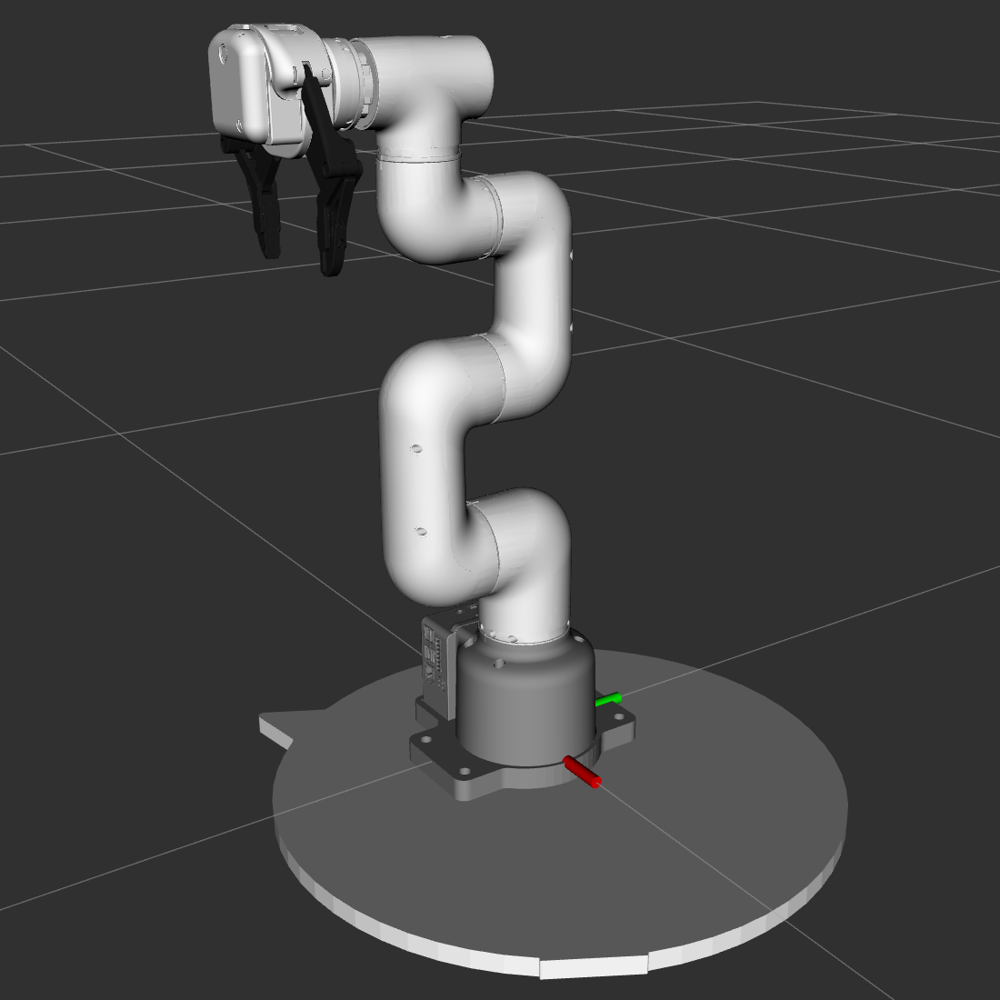
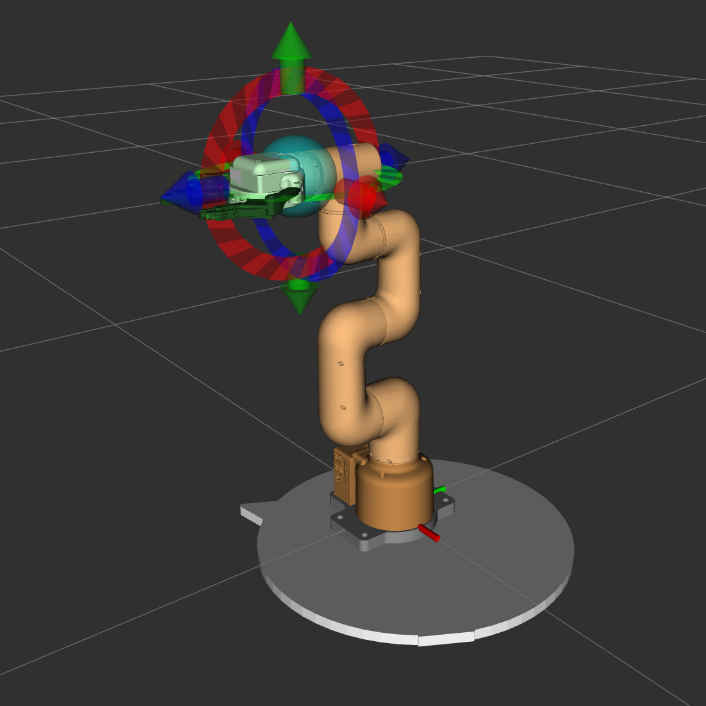

# CobotStudio

Paquetes de ROS2 para el robot cobot320 pi de Elephant Robotics. Facilita la programación offline y permite enviarle comandos directamente al cobot a través de la API *pymycobot* desarrollada por el fabricante.

[](https://github.com/elephantrobotics/mycobot_ros2)
[](https://github.com/elephantrobotics/pymycobot)

## 1 Instalación

Aunque se sugiere trabajar con una instalación nativa de Ubuntu, el mismo procedimiento aplica a máquinas virtuales, como por ejemplo, [WSL2](https://learn.microsoft.com/en-us/windows/wsl/install).

### 1.1 Requisitos

#### Python API

Para enviar comandos al robot físico a través de su Raspberry Pi se requiere la instalación de la [Python API](https://github.com/elephantrobotics/pymycobot) en el dispositivo. 

```bash
pip install pymycobot --upgrade
```
#### ROS2

Según se indica en [mycobot_ros](https://github.com/elephantrobotics/mycobot_ros2), las versiones soportadas son:

* Ubuntu 20.04 / ROS2 Foxy - branch `foxy`
* Ubuntu 20.04 / ROS2 Galactic - branch `galactic`
* Ubuntu 22.04 / ROS2 Humble - branch `humble`

La versión utilizada para el desarrollo de las rutinas es `humble`. No se testeó la compatibilidad con el resto.

#### Opcional: MoveIt 2

[](https://github.com/moveit/moveit2)

Para acceder a funcionaldades *drag and drop* y de planeamiento de trayectorias a través del paquete [mycobot_moveit](https://github.com/EmaGonzalez3/CobotStudio/tree/main/mycobot_320/mycobot_moveit).

```bash
sudo apt install ros-humble-moveit
```

### 1.2 Descarga y compilación

Clonar el repositorio en el colcon workspace.

```bash
cd ~/colcon_ws/src
git clone https://github.com/EmaGonzalez3/CobotStudio.git
cd ~/colcon_ws
colcon build
source ~/colcon_ws/install/setup.bash
```

A modo de evitar el source en cada terminal nueva, se sugiere:

```bash
sudo echo 'source ~/colcon_ws/install/setup.bash' >> ~/.bashrc
```

## 2 Paquetes de ROS2

Para visualizar el robot y poder comenzar a programarlo de manera offline se debe lanzar alguno de los paquetes. El paquete base [mycobot_320](./mycobot_320/mycobot_320/) es el más sencillo, ofrece la visualización del robot, su entorno, las ternas asociadas y la interacción con las mallas que se agreguen a la escena. El paquete de MoveIt [mycobot_moveit](./mycobot_320/mycobot_moveit) permite interactuar con la representación virtual del robot mediante funcionalidades *drag and drop* y la planificación y ejecución de trayectorias. En primera instancia, se sugiere comenzar por el paquete base.


**Nota**: aunque se puede trabajar con ambos simultáneamente, es recomendable elegir solamente uno y lanzar el otro de ser necesario.

La descripción del robot a través del archivo .urdf.xacro admite como argumento la orientación de la herramienta. En el laboratorio se cuenta con la posibilidad de montar la pinza de forma que su eje z queda alineado a la brida del robot.

```bash 
ros2 launch mycobot_320 move.launch.py
```
[Paquete base](./mycobot_320/mycobot_320/)



```bash
ros2 launch mycobot_moveit demo.launch.py gripper_align:=true
```
[MoveIt](./mycobot_moveit/)



## 3 Diseño de rutinas

Las rutinas se componen generalmente de un archivo que describe la escena y otro con las instrucciones a ejecutar por el cobot. Antes de proceder al diseño propiamente dicho, vale mencionar algunas consideraciones para mejorar la experiencia de uso:

1. En todo código, ya sea de rutina o de escena, para importar las funcionalidades necesarias debe agregarse al principio la siguiente línea: 
    ```python
    from Cobot_sdk import *        
    ```
    Luego se puede importar cualquier otra librería o paquete que se considere necesario. Algunas como `numpy` y `time` ya viene incluidas en [Cobot_sdk.py](./mycobot_320/mycobot_320/CobotStudio_core/Cobot_sdk.py).

2. Para tener acceso a funciones de IntelliSense (como Pylance) y facilitar la escritura de código, se recomienda trabajar con VSCode abriendo la carpeta correspondiente a la raiz del repositorio.

3. La manera de ejecutar el código es a través del [CobotLauncher](./mycobot_320/mycobot_320/CobotLauncher.py) (más información en la sección correspondiente). Se requiere que los proyectos se encuentren dentro de una carpeta presente en el mismo nivel que dicho archivo, pudiendo agregar todas las que se consideren necesarias.

4. El archivo con la escena debe encontrarse en el mismo directorio que el de la rutina de movimientos, o dentro de un subdirectorio de éste.

5. Las distintas funciones de lectura y escritura de datos están pensadas para trabajar con esta estructura. De modificarla, no correrán satisfactoriamente y habrá que modificar el código de manera acorde.

### 3.2 Celda robótica

Las celdas se componen por el robot, tal cual se encuentra instalado, y los elementos externos con los que deba o no interactuar. De manera offline, la representación del espacio se logra mediante mallas que pueden ser, por ejemplo, archivos .stl.

El archivo de escena comienza con la importación del sdk y luego debe iniciar una función con la siguiente definición:

```python
def setup_scene(robot: ROSManager):
```

La razón de ser es que éste será el nombre que buscará la función encargada de cargar la escena mediante la importación del módulo a la hora de ejecutar la rutina en el entorno virtual.

Seguidamente comienza la inclusión de mallas a través de la función [add_scene_object](CobotStudio_doc.md#add_scene_objectname-pose_init-size-color-shape-movable-mesh-rot_euler). Tener en cuenta que los argumentos de posición en ROS consisten en metros y radianes. Además los colores (RGBA) están normalizados entre 0 y 1. Para acceder a mallas primitivas se recomienda aprovechar el diccionario `Shapes` que provee el sdk.

Ejemplos:

```python
robot.add_scene_object(name="base_termo",
        pose_init=(400.0e-3, -100e-3, 192e-3),
        size=(100.0e-3, 100.0e-3, 46.0e-3),  # escala en metros
        color=(233/255, 169/255, 105/255, 1.0),
        movable=False,
        shape=Shapes.CUBE,
        rot_euler=(0, 0, 1.06))

robot.add_scene_object(name="mate",
        pose_init=(280.0e-3, -210e-3, 180e-3),
        size=(1.0e-3, 1.0e-3, 1.0e-3),  # escala en metros
        color=(154/255, 114/255, 71/255, 1.0),
        shape=Shapes.MESH,
        movable=False,
        mesh="file:///home/ema/colcon_ws/src/mycobot_ros2/mycobot_320/mycobot_320/scripts/Mate/Mallas/Mate.STL",
        rot_euler=(np.pi/2, 0, -0.48))
```
Notas:

- La ubicación de los elementos en el paquete base no se puede hacer de manera interactiva, sino que es necesario correr iterativamente el código en el launcher hasta lograr la configuración deseada.
- Durante el armado de la escena, lo más probable es que uno no tenga intención de correr la rutina de movimientos (probablemente ni siquiera exista aún). Se recomienda agregar luego `setup_scene()` otra función que la llame:
    ```python
    def run(robot, **kwargs):
        setup_scene(robot)
    ```      
    De esta manera, se podrá ejecutar en el launcher el script que contiene la escena en lugar de las instrucciones de movimiento. Es un requisito esta última función porque, de modo análogo a `setup_scene()` el programa busca `run()` en el módulo importado.

- Al trabajar con objetos .stl la posición y orientación se referencia al origen de la propia malla en relación a la base del robot. Por este motivo, si se opta por modelar en CAD, se sugiere elegir la terna de origen de modo tal que facilite el armado de la escena.

### 3.3 Funciones del robot

La función principal debe definirse de forma tal que sea reconocida en la importación del módulo:

```python
def run(robot: BaseRobotController, speed):
```

El argumento de velocidad permite pasar esta variable desde la consola mediante el launcher. Queda a criterio del usuario emplearla para el control de velocidad de la rutina o redefinirla para aprovecharla con algún otro fin.

Lo más usual es comenzar llamando a la función [load_scene](CobotStudio_doc.md#load_scenescene_filename-subfolder) para cargar la escena en RViz. Vale mencionar que es ignorada al ejecutar el código en la Raspberry Pi del cobot real.


#### 3.3.1 Enseñanza de ternas

Es posible pueden definir las ternas a utilizar como la herramienta, referencias (workobjects) y las poses objetivo para el robot (robtargets). Existe también la posibilidad de importar las variables por tenerlas definidas previamente. En tal caso, se sugiere colocarla en un subdirectorio de la carpeta del proyecto actual y llamar a la función [load_data](CobotStudio_doc.md#load_datasubfolder-filename-var_name-verbose).

En robótica industrial, generalmente las ternas de referencia y las herramientas se "enseñan" a la máquina, llevando al robot a una serie de poses y corriendo un algoritmo matemático para calcular la transformación en el espacio correspondiente. En el cobot en cuestión, se puede cargar un workobject con el método [load_workobject](CobotStudio_doc.md#load_wobjarchivo-wobj_name-tool-auto_teach-q_teach) y, de no encontrarse, se ofrece la opción para proceder con la enseñanza. Dicho método está pensado para el robot real, pero permite ejecutarse en el entorno virtual pasando como argumento una lista de vectores de variables articulares que cumplen el rol de poses enseñadas.

La herramienta enseñada es la misma para la mayoría de las rutinas, por lo que no es estrictamente necesario enseñarla. De todas maneras, el método [teach_and_save_TCP](CobotStudio_doc.md#teach_and_save_tcpfilename-tcp_name-save_q-q_test) actúa de manera análoga al anterior. Hay que tener en cuenta que el método de enseñanza calcula únicamente la traslación de la brida al TCP, por lo que la rotación debe agregarse en el código.

En caso de definirlas por inspección en RViz, las ternas se construyen con la librería [Spatial Maths for Python](https://bdaiinstitute.github.io/spatialmath-python/) permitiendo indistintamente trabajar con vectores de traslación y cuaterniones, ángulos de Euler, matrices homogéneas y productos de transformaciones. A diferencia de ROS, se utiliza el milímetro. Se puede definir entonces una referencia como por ejemplo:
```python
# Las siguientes expresiones son equivalentes:
mesa = SE3(125, -337, 162)*SE3.Rz(np.deg2rad(60))*SE3.Rx(np.pi)
mesa = SE3(125, -337, 162)*UnitQuaternion([0.0, 0.866, 0.5, 0.0]).SE3()
```

Claro está que no es inmediata la visualización de las ternas a partir de una línea de código y es necesario iterar en RViz hasta lograr la transformación deseada. El paquete de MoveIt ofrece ciertas facilidades a la hora de definir ternas pero se abordarán más adelante. 

En el caso de las poses objetivo o robtargets, será necesario definir la configuración con la que el robot las alcanza. Resulta de utilidad evaluar las posibilidades mediante [view_pose_configs()](CobotStudio_doc.md#view_pose_configsrobt-tool-wobj).

Las demás herramientas del paquete base que resultan de utilidad se encuentran en la sección [Previsualización de poses](CobotStudio_doc.md#22-previsualización-de-poses) de la documentación.

#### 3.3.2 Movimientos

Las funciones principales de movimiento corresponden a movimientos joint, cartesianos y al control de la pinza: [Movimiento](CobotStudio_doc.md#11-movimiento). Se pueden leer y ejecutar también trayectorias generadas a partir del plugin MotionPlanning de MoveIt a través de [traj_moveit()](CobotStudio_doc.md#traj_moveitarchivo-traj_name-tool).

Como es habitual, se ofrecen las funciones [offset](CobotStudio_doc.md#offsetdx-dy-dz-rx-ry-rz) y [relTool](CobotStudio_doc.md#reltooldx-dy-dz-rx-ry-rz) para modificar el robtarget que se considera en la instrucción.

En rutinas sencillas de pick&place lo mencionado hasta aquí es suficiente para cubrir las necesidades básicas, tanto del entorno virtual como del real.

#### 3.3.3 MoveIt

Las funciones del apartado [MoveIt](CobotStudio_doc.md#3-moveit) funcionan únicamente en el paquete en cuestión. Aunque no son estrictamente necesarias y es factible armar rutinas sin acudir a ellas, facilitan considerablemente el trabajo con la cadena cinemática del cobot que, en la práctica, demuestra cierta complejidad. A modo de disponer de IntelliSense, se recomienda crear una nueva función dentro de `run()` donde se referencia a la instancia virtual `ROSManager`. 

Ej:
```python
def run(robot: BaseRobotController, **kwargs):
    def moveit(robot:ROSManager):
        robot.moveit_manager.move_goal(...)
    
    moveit(robot)
```

Esto no es estrictamente necesario pero facilita ordenar las funciones del código de la rutina.

Para seleccionar configuraciones filtrando aquellas que presentan colisiones se cuenta con [check_pose_configs](CobotStudio_doc.md#check_pose_configsrobt-tool-wobj-filtrar). Si las mallas se agregan con la pestaña *Scene Objects* de MotionPlanning entonces también serán tenidas en cuenta.

El robot que se visualiza en MoveIt es interactivo: el usuario puede arrastrar el marker o las flechas en pantalla para mover al robot. Un solver de la cinemática inversa resuelve en tiempo real cómo articular al robot en cada caso. Así, es factible analizar si se puede alcanzar una cierta pose o zona sin necesidad de iterar corriendo las funciones discutidas en apartados previos. No obstante, el solver decide por sí mismo la configuración articular por lo que arrastrar el marker puede no ser tan práctico. En estas ocasiones [move_goal()](CobotStudio_doc.md#move_goaltarget-tool-wobj-publish_tf-tf_frame_name-tf_reference-timeout) resulta de utilidad puesto que permite mover al objetivo según un robtarget que contiene la configuración deseada.

El planeamiento de trayectorias se puede realizar a través de la pestaña *Planning* del plugin o llamando a [plan_and_execute()](CobotStudio_doc.md#plan_and_executeq_goal-q_start-tool-wobj-execute-update_rviz-timeout). Luego, si se desea guardar dicha trayectoria, se dispone de [save_trajectory](CobotStudio_doc.md#save_trajectoryfilename-variable_name). La misma se puede ejecutar en RViz o en el robot real, como se mencionó antes, a través de [traj_moveit()](CobotStudio_doc.md#traj_moveitarchivo-traj_name-tool).
Un detalle a tener en cuenta al planear trayectorias a mano es que si se alterna entre `move_goal()` y las opciones de la pestaña *Planning* la ejecución puede fallar. El inconveniente radica en que mover al goal mediante código genera inconsistencias entre la posición actual que lee el planner y la que publica el robot. Se puede solucionar fácilmente con el argumento `execute`. Ej:
```python
robot.moveit_manager.plan_and_execute(robt1, tool=pinza, execute=True)
```
Esto actualiza la posición actual tanto para la representación del robot como para el planner y soluciona el conflicto.

## 4 Ejecución

Para la ejecución, se dispone de un [launcher](./mycobot_320/mycobot_320/CobotLauncher.py) que recibe como argumentos la ruta relativa de la rutina y el modo de trabajo: `ros`/`real`. Siguiendo las recomendaciones previas, al abrir en VSCode la ruta base del repositorio la consola se abre automáticamente en la ruta padre de las rutinas. Así, uno puede ejecutarlas como:

```bash
~/colcon_ws/src/mycobot_ros2/mycobot_320/mycobot_320$ python3 CobotLauncher.py scripts/Mate/Cebar_rev2.py ros
```

Para enviarlo al robot real simplemente se reemplaza el argumento `ros` por `real`. Claro está que este caso corresponde únicamente a ejecuciones desde la Raspberry Pi del cobot.

Si se desea replicar los movimientos del robot real mientras ejecuta una rutina en una instancia de RViz de una PC conectada mediante Ethernet, se debe ejecutar en esta última el script [Cobot_client.py]() y agregar el argumento adicional `--bridge` en la referencia al launcher. Adicionalmente se permite pasar como parámetro por consola una variable `speed` pensada para controlar la velocidad de las rutinas. Claro está que la programación de la rutina debe haberla tenido en consideración.

Ej:

```bash
python3 CobotLauncher.py scripts/NDLM/NDLM_Llaveros_rev5.py ros --speed 80 --bridge
```